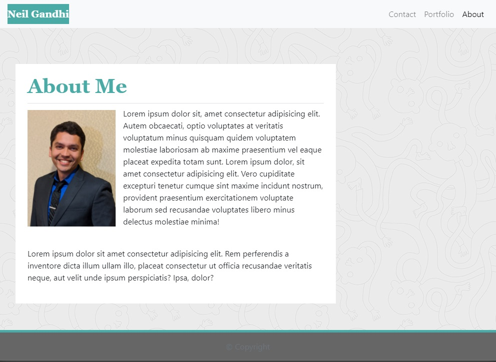
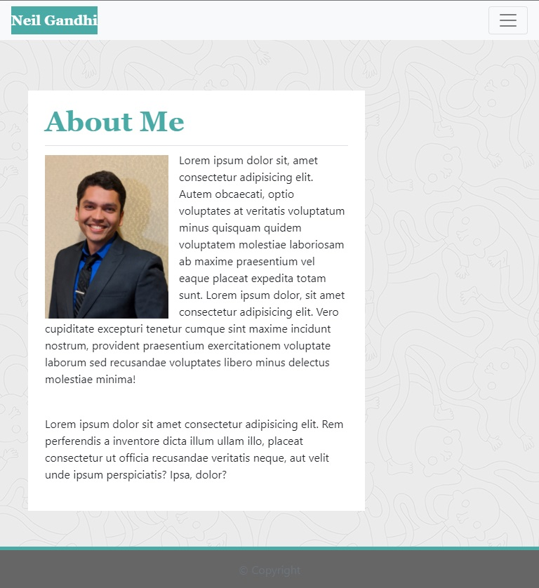
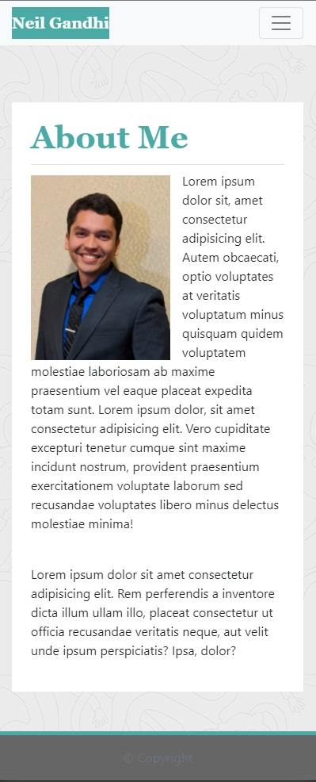
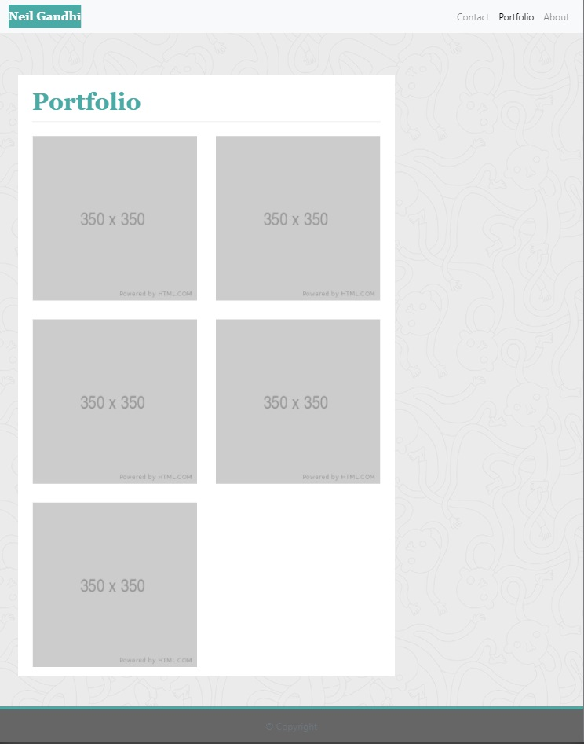
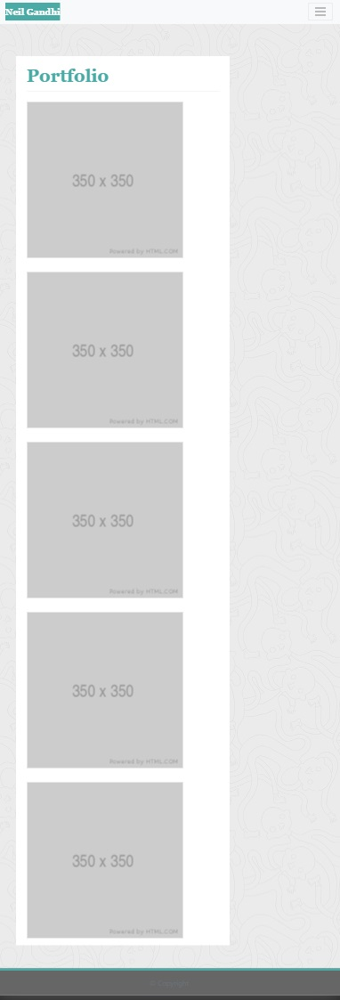
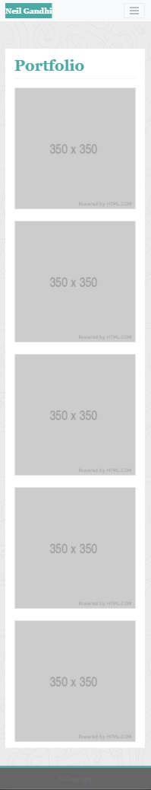
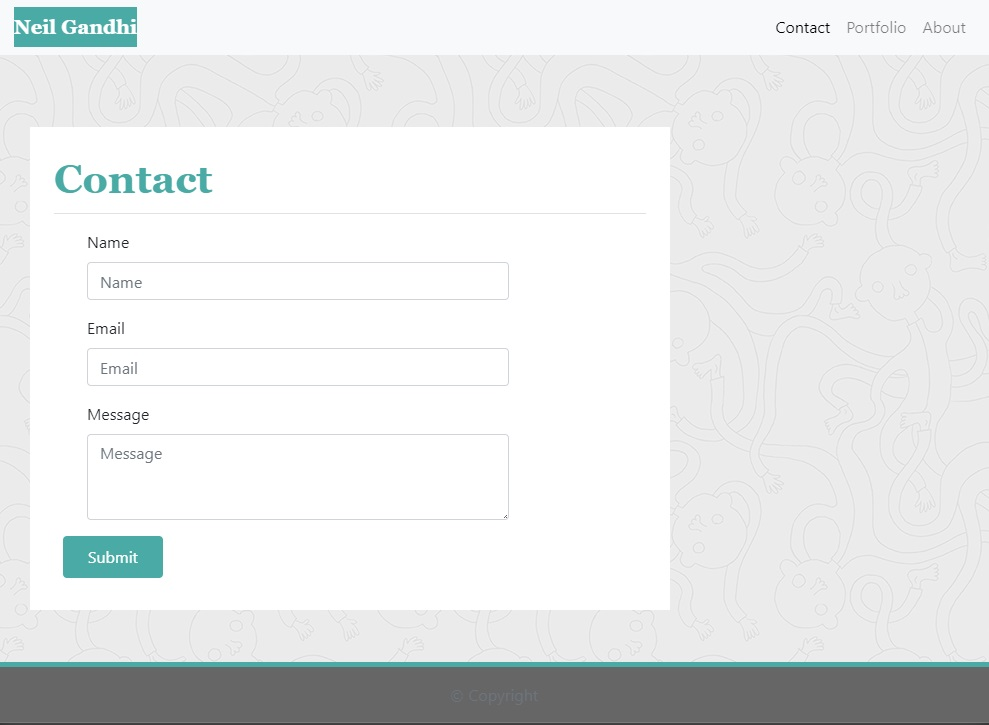
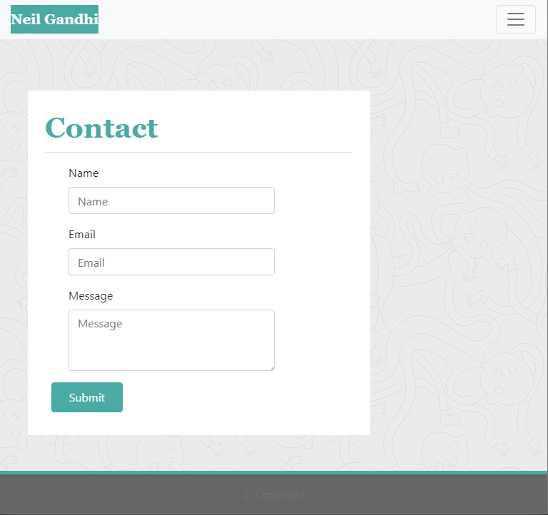
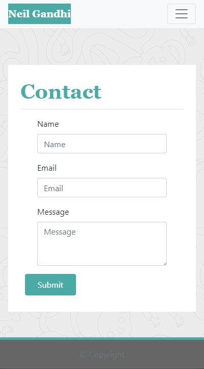

# Neil Gandhi Portfolio

## Description

This project is the baseline of what will be a Career Portfolio webpage for the work done in this course. This webpage will hightlight the skills learned in this bootcamp as well as provide examples of work to prospective employers/visitors.

This page will utilize all the skills learned in the course to showcase my capabilities and will be a page that can be linked to containing any and all information needed to become employer-competitive.

## Table of Contents

- [Installation](#installation)
- [Development Notes](#development-notes)
  - [Development Challenges](#development-challenges)
- [Usage](#usage)
  - [Index.html](#index.html)
  - [Portfolio.html](#portfolio.html)
  - [Contact.html](#contact.html)
- [Credits](#credits)

## Installation

In order to view this application, please visit the main page [https://ntch2000.github.io/neilgandhi-portfolio/](https://ntch2000.github.io/neilgandhi-portfolio/). The links in the top navbar allow for navigation to the other pages of the application (portfolio.html and contact.html).

To see the code base for this page, visit my github page [https://github.com/ntch2000/neilgandhi-portfolio](https://github.com/ntch2000/neilgandhi-portfolio). The code can be viewed directly in the github repository or downloaded and viewed in any text editor.

## Development Notes

This is just the baseline career page which will be added to as additional skills are learned. Currently the information on the page may not be complete, but will be added to in subsequent releases.

### Development Challenges

The proper colors for the pages was one of the first challenges faced. This was remedied by utilizing the asset images provided and inspecting the colors with MS Paint. This allowed for the exact hex code to use for each element.

The most challenging portion of this application was ensuring proper spacing and utilizing the Bootstrap grid layout to obtain the proper responsiveness for each breakpoint and pixel width.

Ensuring the biography image and biography text information fit on a single row and wrapped properly was another challenge that was faced. This was corrected by ensuring the the image and text was in a single column, with the image sized appropriately in the css and floated to the left.

Finally, the submit button on the contact form was another challenge as the spacing the position was difficult to achieve. The padding nad margin of the button had to be adjusted to get the proper look.

## Usage

The following are screen captures of the various pages at each responsive breakpoint.

### Index.html

---

#### 992 Pixel Breakpoint

#### 768 Pixel Breakpoint

#### 400 Pixel Breakpoint

### Portfolio.html

---

#### 992 Pixel Breakpoint

#### 768 Pixel Breakpoint

#### 400 Pixel Breakpoint

### Contact.html

---

#### 992 Pixel Breakpoint

#### 768 Pixel Breakpoint

#### 400 Pixel Breakpoint

## Credits

The resources used to help develop this application are as follows.

- The [Bootstrap 4](#https://getbootstrap.com/) framework was used to create the majority of the page and css styles. This allowed for proper layout and responsiveness required for the page.
- The sticky footer for each page was created utlizing the sticky footer example from [Bootstrap 4 Sticky Footer](#https://getbootstrap.com/docs/4.0/examples/sticky-footer-navbar/)
- The placeholder images were obtained from [Placeholder Images](#https://via.placeholder.com/150).
- The TA Peter Colella helped find the proper background image to use on the pages.

---

© 2020 Neil Gandhi
