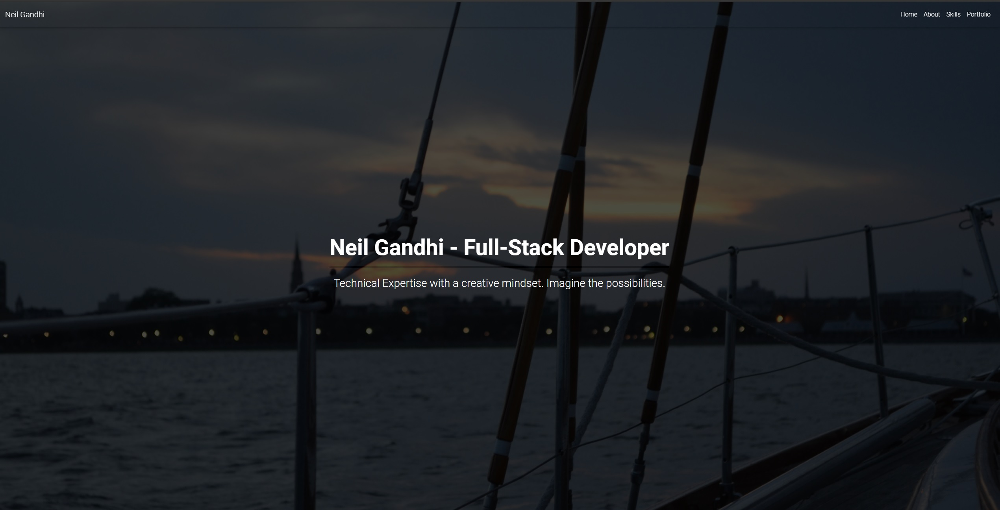
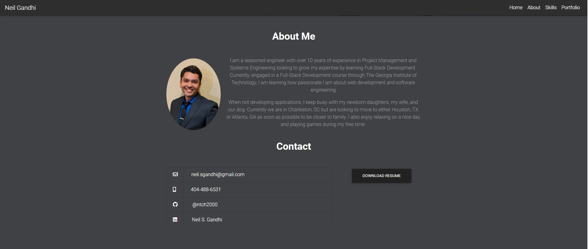
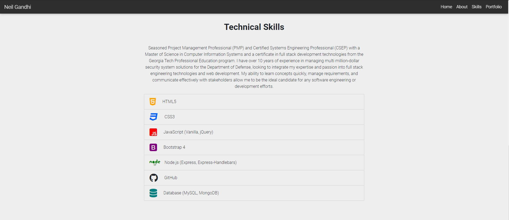
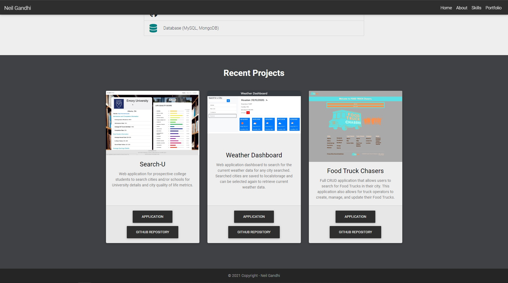

# Neil Gandhi Portfolio

## Description

This project is the updated Career Portfolio webpage for the work done in this course. This portfolio highlights the skills learned in this bootcamp as well as provides examples of work to prospective employers/visitors.

This page will utilize all the skills learned in the course to showcase my capabilities and will be a page that can be linked to containing any and all information needed to become employer-competitive.

## Table of Contents

- [Installation](#installation)
- [Development Notes](#development-notes)
- [Usage](#usage)
  - [Index.html](#index.html)
- [Credits](#credits)

## Installation

In order to view this application, please visit the main page [https://ntch2000.github.io/neilgandhi-portfolio/](https://ntch2000.github.io/neilgandhi-portfolio/). The links in the top navbar allow for navigation to the other pages of the application (portfolio.html and contact.html).

To see the code base for this page, visit my github page [https://github.com/ntch2000/neilgandhi-portfolio](https://github.com/ntch2000/neilgandhi-portfolio). The code can be viewed directly in the github repository or downloaded and viewed in any text editor.

## Development Notes

This is the newly updated career portfolio page, with personalized information as well as new styling. This page will continue to evolve as new technologies are learned and new frameworks integrated to provide the best portfolio page possible with the end result to obtain a new career in web-development.

I decided to change the portfolio to a single page, requiring scrolling down to each section. This makes the portfolio more modern and in line with some of the new portfolio designs I have seen for 2020. I utilize MDBootstrap to incorporate some Material Design type styling and will continue to try to expand my CSS frameworks to building something more unique.

## Usage

The following are screen captures of the updated portfolio pages.

### Index.html

---

## Credits

The resources used to help develop this application are as follows.

- The [Bootstrap 5](https://getbootstrap.com/) framework was used to create the majority of the page and css styles. This allowed for proper layout and responsiveness required for the page.
- The [MDB](https://mdbootstrap.com/docs/standard/) framework which incorporates Material Design 2.0 with Bootstrap 5, allowing for some more modern CSS effects and a more streamlined portfolio page.
- I used [Font Awesome](https://fontawesome.com/) icons for the contact page as well as the skills section.

---

© 2021 Neil Gandhi
